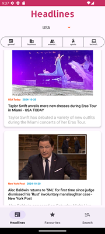
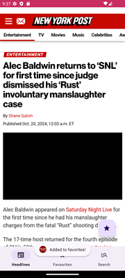
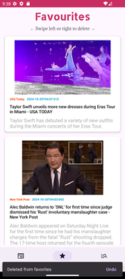
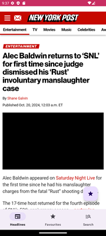
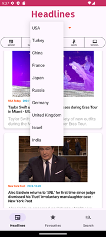
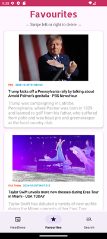
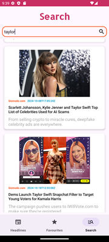
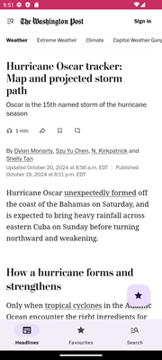

# NewsApp

This is a comprehensive news application developed using **Kotlin** and **Android Studio**. The app enables users to view news headlines, search for articles, and manage their favorite articles. It adheres to modern best practices in Android development, employing the **MVVM architecture**, **Room Database** for local storage, **Retrofit** for API interactions, and **Dagger Hilt** for dependency injection.

## Table of Contents

- [Features](#features)
- [Technical Stack](#technical-stack)
- [Architecture](#architecture)
- [Setup and Installation](#setup-and-installation)
- [Screenshots](#screenshots)

## Features

- **View Headlines**: Fetch and display news headlines categorized by country and topic (e.g., business, entertainment, sports).
- **Search Functionality**: Search for news articles by entering keywords.
- **Favorites Management**: Save articles to a favorites list for later viewing.
- **Offline Storage**: Cache articles marked as favorites using Room Database for offline access.
- **Error Handling**: Gracefully handle errors and provide user feedback.

## Technical Stack

- **Kotlin**: Primary programming language for Android development.
- **Android Studio**: IDE used for building and maintaining the application.
- **XML Layouts**: Used to create user interface components.
- **Retrofit**: Type-safe HTTP client for network requests to the news API.
- **Room**: Persistence library for database management with SQLite backend.
- **Dagger Hilt**: Dependency injection framework for efficient management of dependencies.
- **RecyclerView**: For displaying news articles.
- **LiveData**: For observing and updating the UI.
- **Coroutines**: For handling asynchronous operations.

## Architecture

The application follows the **MVVM (Model-View-ViewModel)** architecture, promoting separation of concerns, making the codebase manageable and testable.

### Components

- **Model**: Data layer for network requests and database operations.
- **View**: Composed of XML layouts rendering the user interface.
- **ViewModel**: Bridges the View and Model, holding UI-related data and managing user interactions.

## Setup and Installation

1. Clone this repository:
   ```bash
   git clone https://github.com/muameh/NewsApp.git












